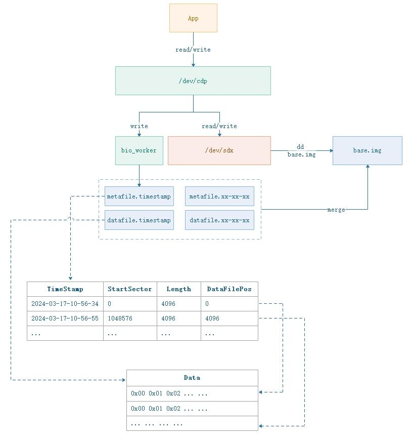

# BlockCDP项目介绍

## 背景介绍
起源于一个sourceforge 2006年的开源项目 https://sourceforge.net/projects/q-phoenix/ Block Based CDP module for linux kernel，这个项目距离现在已经超过10几年了，从网站看到代码只更新了一次是2006-05-02。代码量不大，很快就可以看完，因为是很老的代码，只适用于很老的linux内核版本。个人觉得这个代码的思想有值得参考的部分，当然了，也有不少可以改进的地方，正是因为有不少可以改进提升的地方，才会引出OpenCDP下面BlockCDP的开源版本，既然思想来自于开源，那么就应该反馈开源社区。我觉得这个项目的作者开始可能只是一种验证技术思路，并没有想过把他发展壮大起来，这点得有点可惜，估计也是这个缘故，这个项目并没有大范围的传播开来，就这样被埋没了。  
先普及一下CDP（continuous data protection）持续数据保护是一样什么东西，否则就无法理解它的真正价值。简单来讲，CDP是一种持续数据保护的技术，把数据每一次修改内容都保存下来，那么它的价值就是可以让你把数据回滚到过去任意一个时刻（理论上只要存储的空间足够大）。这个应用场景是非常多的，如企业数据被勒索病毒感染了，那么可以恢复到过去被感染的一刻，用户不小心误操作删除数据了，也可以回滚到误删除前的那一刻。用通俗的语言来讲，就是一个数据的时光机、一个数据的月光宝盒。  
除了这个实验性质的项目外，暂时没发现国内外有关CDP的开源项目，全部为商业产品为主，因此为了补充这一板块的空缺，才有了这个开源的项目，之所以叫项目而不是产品，是因为距离产品还有很长的路要走，需要打磨的细节很多，非一个人短时间内可以完成。先把技术核心实现部分开源，减少阅读理解时间，除去一些非核心的代码模块。  
在做这个项目的相关知识来自于社区和开源，希望可以做一点小小的贡献回馈开源社区，同时希望越来越多的人参与到这个领域的开源工作，让普通人或者企业都可以享受到开源社区的福利。这个项目基于个人主导，由于个人经验问题，难免会出现考虑不周或者有缺陷的地方，需要不断打磨，也希望得到开源社区的反馈和帮助。  

## 设计原则
参考了sf上面的CDP开源项目，个人觉得这个项目把太多东西都集成在内核模块，整个逻辑相对复杂，复杂意味着损失稳定性和灵活，比如它把数据压缩、恢复这些逻辑都集成在内核模块，其实完全没有必要，可以独立出来在应用层实现，减少内核模块的复杂度。  
在考虑这个项目实现的时候，我参考了unix一个非常重要的软件设计原则 KISS（keep it simple and stupid），如unix、linux的命令，每条命令只解决一个核心的功能，复杂的逻辑通过若干个指令组合实现，这样子每个命令模块都是非常简洁，清晰，这代表代码的稳定性和可读性。因此，BlockCDP内核模块只负责做好一样事情，就是把磁盘的写bio数据落盘到指定的磁盘分区保存成问题，把数据清理、合并的使用python脚本在应用层实现，通过这些组合，完全可以实现我们所需的各项功能。  

## 架构设计

  

cdp.ko内核模块加载后，会创建一个/dev/cdp的块设备，这个块设备会接管对磁盘的读写bio请求，把对应的bio请求转发到具体的磁盘如/dev/sdb，把写的bio会复制一份写到/dev/shm分区目录，生成cdp数据文件datafile，包含了描述这份数据的元数据文件metafile。在应用层来讲，只需要跟普通磁盘一样对/dev/cdp设备操作即可，千万不要对/dev/sdb设备进行写操作，只有经过/dev/cdp的写操作才能产生cdp的增量数据，如果直接写/dev/sdb了，bio请求就不过cdp.ko内核模块了，无法捕捉bio请求数据。  
每一份bio数据都对应有一份元数据，bio数据文件（datafile）记录的是写入磁盘的真实数据，而原数据文件（metafile）记录的是，这份bio数据是什么时候写入磁盘的，写入磁盘对应的开始扇区号和数据长度。正是因为有了这些数据，我们才可以合并数据和回滚数据。在首次使用cdp模块之前，还需要对保护的数据盘/dev/sdb做一次全量备份，可以使用dd命令生成一个磁盘镜像，可以称为基础镜像base.img。有了基础镜像后，之后所有的写数据我们都可以做合并。  
为了使cdp增量数据尽快落盘而不影响正常的bio请求，我们默认把cdp的bio增量数据写入/dev/shm分区，这个分区是基于内存的，因此速度非常快，我们可以选择压缩后再传输到普通机械盘或者SSD盘，也可以选择做历史数据和基础镜像合并，一旦数据合并了，就无法恢复这一部分数据中的任意时刻。datafile增量数据文件大小是可定义的，防止单个文件过大或者文件数量过多，目前默认是10MB，可以自行修改cdp.c文件重新编译。  

## 辅助脚本
提供了两个python脚本，merge.py和merge-core.py，代码实现都非常简单，这里不做详细描述，只讲解实现的功能。merge.py脚本实现扫描/dev/shm的元数据文件，列出可以合并的元数据信息，会生成一个 merge-core.py 的命令，这个merge-core.py 脚本复制把对应的数据合并到基础镜像，后面带test是dry run的意思，就是不会真正合并，只是走一次流程输出相关数据信息，如果用户确认无误可以合并，就只需要把 test 改成 run 执行即可。  

## 展望
这个项目代码量非常少，也非常容易理解，后续会增加一定的复杂性，主要是一些辅助醒和便捷性的功能，比如cdp.ko模块会增加netlink功能，方便用户跟模块做交互设定一些配置选项，会完善辅助的python脚本，使得使用交互更加人性化。一些高级的功能也会考虑，如bio请求的限速，数据的加解密，甚至考虑对接web ui界面等等。  