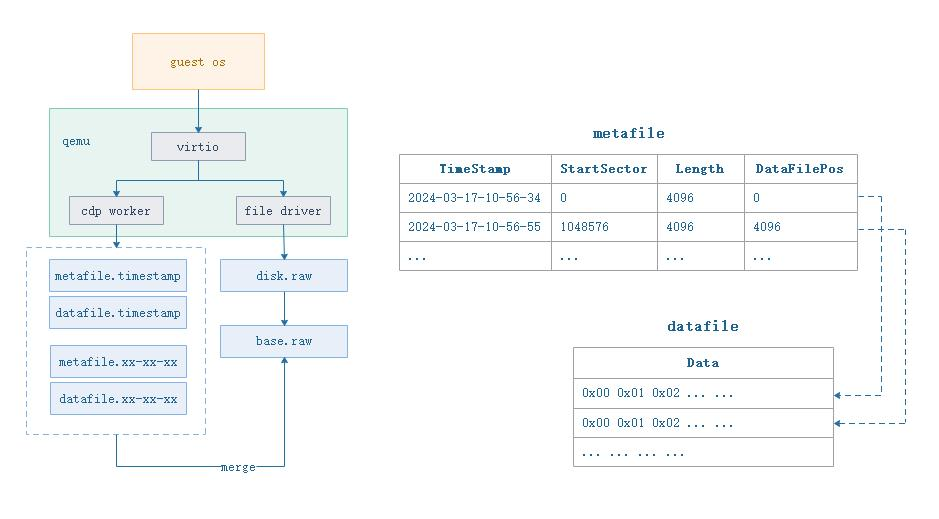

# QEMU-CDP项目介绍

## 背景介绍
在开发BlockCDP项目的时候，就开始构思是否可以拓展一下应用的场景，比如在qemu内置CDP的功能，加上之前通过网上的资料了解到ucloud他们对qemu做了二次开发，实现了对虚拟机增量数据的存储功能。目前虚拟化场景非常普遍，如果直接让qemu集成了这个功能对用户来讲是有很大的使用价值的，花了几天时间研究qemu的代码再加上实际调试，对磁盘读写逻辑这块有了一些了解，因此就尝试对qemu的代码进行改造，从而有了这个开源项目。  

## 方案思路
qemu的版本分支有很多，我选择了一个比较普遍使用的版本stable-2.11进行改造。qemu本身的代码设计已经充分考虑了分层如驱动层、文件层、抽象层等，所以改造起来也比较的顺利，只要不去动qemu的协程这部分代码即可，我们自己单独开一个cdp的普通线程，个人觉得qemu自己封装的那套协程太复杂了，一个磁盘对应一个cdp线程对系统来讲负荷还是可以接受的。  

  

## 代码修改
|修改文件|修改内容|
-|-
|block/block-backend.c|在block-backend抽象层增加一个cdp数据的提交接口cdp_push_write_req 这个接口会调用file driver驱动层的bdrv_co_cdp_push_write接口|
|block/file-posix.c|这个file-posix.c是qemu具体file driver驱动层的实现，也是这个改造增加内容比较多的地方，因为我们只对使用file驱动才支持cdp功能，所以就只改造了这个地方，有需要的话可以延申到其他驱动层比如ceph等。这里会创建一个cdp的工作线程cdp_work_thread这个线程会把虚拟机磁盘写数据生成对应的元数据文件和数据文件保存到磁盘/dev/shm目录下面。|
|block/trace-events|这个trace events是qemu事件日志机制，可以自己增加接口输出日志，为了方便观测cdp模块工作情况，增加了2个trace接口cdp_co_push_write、cdp_write_wait_reqs_count|
|hw/block/virtio-blk.c|在选择什么时候提交cdp数据，我暂时选择了基于virtio驱动下blk complete的时候，就是说只有基于virtio驱动磁盘的方式下该cdp功能才会生效，一般来讲都会采用virtio驱动，因为idc的驱动实在性能太差。这里调用block-backend的接口cdp_push_write_req把cdp数据提交出去。|
|include/block/block_int.h|增加头文件函数原型 bdrv_co_cdp_push_write|
|include/sysemu/block-backend.h|增加头文件函数原型 cdp_push_write_req|

## 不足与思考  
- 1.是否把出发调用cdp的接口放在block-backend.c的 blk_aio_complete 里面去调用更加合适？
- 2.目前还没考虑一个qemu进程挂载多个磁盘下生成不同cdp数据文件的问题，需要区分开来。

## 展望
基于qemu的改造只是一个初期的实验项目，可能存在设计不合理或其他潜在的稳定性问题，需要更多的测试和迭代完善。  