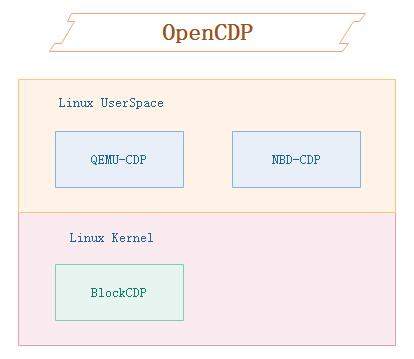

#### English | [简体中文](README_CN.md)

# OpenCDP
The OpenCDP project is an open source plan, which consists of several specific implementation projects.  Currently, there are BlockCDP based on Linux block devices and QEMU-CDP based on qemu secondary development.  In the future, CDP functions based on NBD will be added.  

  

## BlockCDP
[BlockCDP](https://github.com/OpenCDP/BlockCDP)
is a Linux kernel-based implementation of block device CDP.  Currently, due to limited resources, I have only developed a version for Ubuntu 18.04.  Because the kernel module-related bio interface is strongly related to the kernel version, different distributions may require re-tuning and adaptation of the kernel. This BlockCDP is based on the Linux kernel block device level CDP, which is relatively versatile and only requires specifying a disk to perform CDP protection on the data under that disk.  

##  QEMU-CDP  
[QEMU-CDP](https://github.com/OpenCDP/QEMU-CDP/tree/stable-2.11)
is a CDP implementation based on qemu. Implementing CDP at the virtual machine level is also a common scenario. At present, it is understood that some public cloud vendors such as ucloud have implemented CDP functionality at the qemu layer, but they are not open source.  Therefore, I have also made a qemu version based on my personal understanding.  This version is a fork of the official qemu stable 2.11 branch. There are not many adjustments and modifications made on it. Specifically, it implements the ability to save the data and corresponding information written to the disk by the virtual machine every time based on file raw + virtio.  

## NBD-CDP  
NBD-CDP is a CDP implementation based on NBD, which is a network block device implementation.  In fact, NBD already has a built-in feature called transactionlog that is similar to CDP, which can be used to achieve the effect of CDP. NBD also provides some auxiliary tools such as nbd-trdump (dump transactionlog) and nbd-trplay (replay transactionlog). Currently, this project is in the planning stage and has not yet submitted code.

