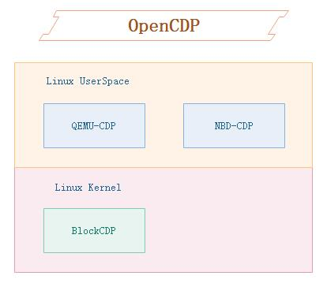

# BlockCDP
OpenCDP项目是一个开源计划，这个项目下面会有几个具体的实现项目构成，目前有基于Linux块设备的BlockCDP、基于qemu二次开发的QEMU-CDP，后续会增加基于NBD等CDP功能实现。  

  

相关背景可以先参考BlockCDP项目的介绍，在做这个项目的时候发现，我们可以把相关的技术应用到其他场景，这样可以给用户多种选择，增加了灵活性，因此衍生出OpenCDP，它是一个抽象的项目，下面由具体CDP的实现组成，所有的目标都是围绕着CDP这一个核心功能。  

## BlockCDP  
[BlockCDP](https://github.com/OpenCDP/BlockCDP)
是一个基于Linux内核的块设备CDP实现，目前由于精力有限，我只在Ubuntu18.04环境下开发了一个版本，因为内核模块相关bio接口跟内核版本有强关联，因此不同的发行版对应的内核可能需要重新调整适配。这个BlockCDP是基于Linux内核块设备级别的CDP，通用性也比较广，只需要指定一个磁盘即可对该磁盘下的数据做CDP保护。  

##  QEMU-CDP  
[QEMU-CDP](https://github.com/OpenCDP/QEMU-CDP/tree/stable-2.11)
是一个基于qemu改造的CDP实现，在虚拟机层面实现CDP也是一个比较普遍的场景，目前了解到有一些公有云厂家如ucloud已经在qemu层实现了CDP的功能，但是他们没有开源，因此我这里也依照我个人的理解做了一个qemu的版本，这个版本是fork官方的qemu stable 2.11 branch的，在上面做的调整修改并不多，具体实现了基于file raw + virtio 下，把虚拟机对磁盘的每次写入的数据及对应的信息都保存下来。  

## NBD-CDP  
是一个基于NBD改造的CDP实现，NBD是一个网络块设备实现，其实NBD已经内置了类似CDP的功能叫transactionlog，可以借助这个事务日志功能实现CDP的效果。NBD还提供了一些辅助工具如 nbd-trdump（dump transactionlog） 、nbd-trplay（回放transactionlog）。目前这个项目处于计划构思阶段，暂未提交代码。

